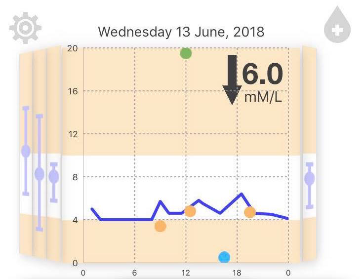
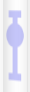

# Bifocal Display Breakdown

### Functionalities
The most important infomation gets displayed on the main graph while less relevant data is displayed on the side views. 

Scrolling across x-axis would allow users to access detailed data on a certain day.

**On the main graph:**
This seciton displays monitored glucose level on a day (would be taken from patients' wearables) and it pops entries of daily meals, execises and insulin dosage on the main graph instantly so users can keep track of what time they did those activities. Meesages of detailed information can be obtained when points are tapped. 

For example, a message on how much macronutrients (like carbs, protein and fats) each meal contains would popups when you tap on a meal point. A message for exercise would include exercise done, time it's done and intensity. An insulin message tells what time and how many units of insulin are given.

**On the sideviews:**
It shows range bars (min, max, avg) for individual day.

## ChartBase Setup
The bifocal display consists of three parts: 
  * Leftside view containers
  * Main graph section
  * Rightside view containers

## Left & Right Sideview Containers
Each of the side view containers has three subviews of type CustomView (UIView) which are customized to show colours bands as a background. 
#### *ChartBGView.swift* and *CustomView.swift*
The same colour bands are used on the main chart as well thus *ChartBGView.swift* follows the same logic as the *CustomView.swift* in term of filling the background color bands. But *CustomView.swift* is also used to draw range bars on each sideview using calculated values for glucose values storing in core data on a day.

###### Bands calculations
The bands are calculated based on glucose level. If the total height of the Custom View is considered as an equivalent glucose level of 20 (mM/)L  then a 'safe' range for patients to stay in would be between 4 and 10. Above 10 would be classified as a hyper and below 4 would be seen as a hypo.

Therefore, the top half of chart would be in **high** range, the bottom 4/20 (20%) of chart would be in **low** range and 6/20 (~30%)section in the middle would be of normal. 

The high and low bands are coloured differently to draw users attention. Colour palette here is simple and can be modified. (Colour combinations particularly red & green are avoided as diabetes suffering from retinopathy have problems distinguishing between them.)

#### *drawMiddleBand()*
* **Description:**
This function draws a rectangle with orgin (0,0) - top left corner, and extends itself to the reqired height (30% of total height). After it draws/marks, it colours the marked area with selected color.

* **Returns:**
This would give the background of image below (without the range bars).

    
#### *drawRangeBar()*
* **Description:**
This function is created to draw maximun and minimum dashes as well as the average circle on side views. 
It uses UIBezierPath() as a drawing tool. Both line width and stroke colour can be set using this method.

* **Parameter:**
It takes no parameters but the output of sorting the glucose array on certain day would gives maximum and minimum. The difference  in heights of maximum & minimum with respect to glucose level of 20(mM/L) would be the stroke length of the range bar.

* **Returns:** An UIView with a drawn range bar

A view it creates would be: 

## Main graph section

### *ViewControllerGraph.swift*
In this section we do everything graph related. Things like:
* Transform sideView containers into bifocal. 
* Load tmp arrays into CoreData.
* Show date picker.  
* Update settings.  
* Update popups.

Methods implemented are: 
#### *rightGesture* 
* **Description:** An IBAction func. Once a right swpie gesture is detected, main graph would be replaced by data from one day on the LHS. All other views update accordingly. (Everything shifts to the right)

* **Parameter:** The sender is UISwipeGestureRecognizer

#### *leftGesture* 
* **Description:** An IBAction func. Similar to rightGesture but detects left swipes. When a left swipe is made, it bring RHS data to the centre. (Everything shifts left) 

* **Parameter:** The sender is UISwipeGestureRecognizer

#### *sideTransforms()*
* **Description:** Skews the sideView containers into Bifocal shape. Left view container is 3D rotated 45 degrees around y - axis and right view container is rotated by -45 degrees.

* **Output:** The reshaped version of sideViews as required by clients

#### *loadData()*
* **Description:** Loads data into core data. Produces array of glucose items on selected day

* **Improvements:** Can be made to access data from a csv file

#### *addNotifications()*
* **Description:** Adds popups on to main graph immediately when activity are added

#### *settingPreferences()*
* **Description:** Registers settings bundle. Updates app when settings changed so the UI responds to preferences user selected. For example, user may rather have the basal rate turned off, and when they switch off that button, the basal rate would disappear from graph.

#### *setDay()*
* **Description:** When users swiping across and the chart lands on a certain day or the user picks a date from the picker field, the popups list would be fetched for that day. So users get correct past activities for selected day.

#### *updateViews()*
* **Description:** Removes current drawings and plots on the main graph, replots chart, adds events popups and updates sideviews.

* **Output:** Updated bifocal section

#### *createDatePicker()*
* **Description:** Creates a date picker field on top of bifocal display. Sets it to current date initially. Allows users to pick a date in the past. Chart updates according to date selected. Side views update as well.

#### *calcRanges()*
* **Description:** Finds a maximum, a minimum in a array as well as calculates an average value.

* **Parameters:** An array of Doubles: data in the array to be calculated 

* **Returns:** Passes results to side views. Side view redraws range bar accordingly.

#### *initChart()*
* **Description:** 
  * Chart is constructed using layers. 
  * Draws popups and attaches messages to them.
  * Dates changes accordingly with swipes and plots changes accordingly.
  * Changes of dates gets passed in to update chart. 

Modifications are made on top of an iOS chart library which can be found here: https://github.com/i-schuetz/SwiftCharts.git 
